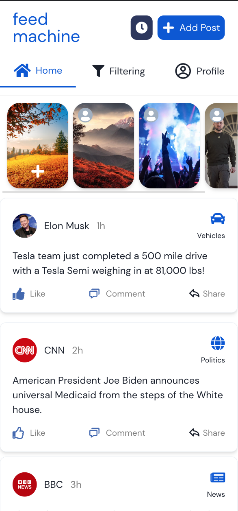

# The Feed Machine

See only the posts you want to see. No more scrolling through your feed to find the posts you actually want to see.

### Running the app

You need to run all components of the app to get started, including a React frontend, a Node.js server and a FastAPI server. You can run all of these with the following command:

```bash
chmod +x ./start.sh && ./start.sh
```

### Screenshots


